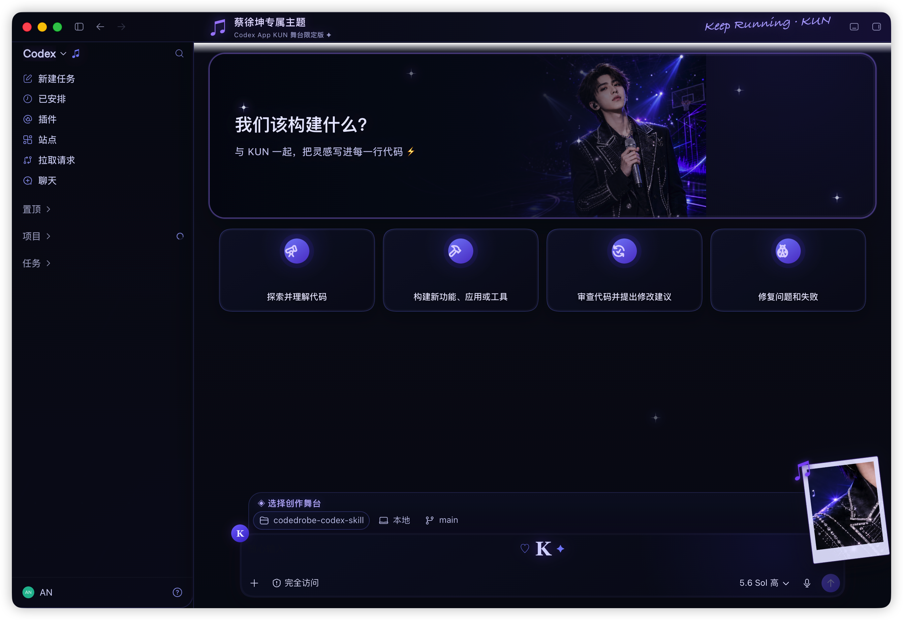
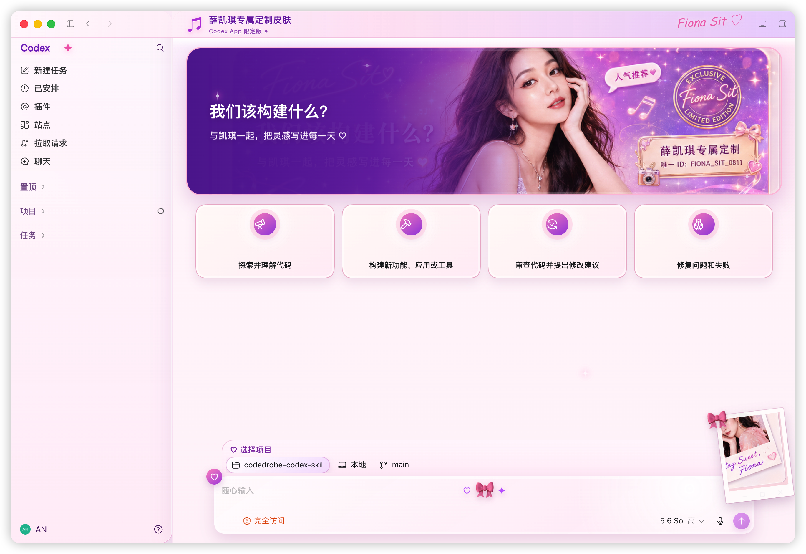
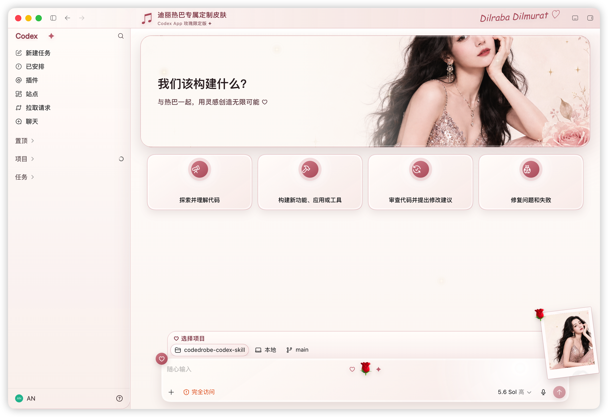

# CodeDrobe Desktop — Theme Manager for AI Desktop Apps

[](https://github.com/CodeDrobe/desktop/releases/latest)
[](https://github.com/CodeDrobe/desktop/actions/workflows/build.yml)
[](https://github.com/CodeDrobe/desktop/releases)
[](LICENSE)
[](https://github.com/CodeDrobe/desktop/releases)

[Chinese](README_zh.md)

Website: [codedrobe.app](https://codedrobe.app) · [Download the latest release](https://github.com/CodeDrobe/desktop/releases/latest)

CodeDrobe Desktop is an open-source theme manager for AI desktop apps — currently **OpenAI Codex**, **WorkBuddy**, **QoderWork**, and **TRAE SOLO** — on macOS and Windows. Browse the CodeDrobe theme store, apply a theme to any supported app with one click, and restore the native interface at any time. Themes only change appearance: your app installation and data stay untouched.


## What's new in v2

Version 2 is a complete rebuild:

- **New UI** built with Tailwind CSS + shadcn-style components, sharing the design language of [codedrobe.app](https://codedrobe.app).
- **Multi-app support** on the new `@codedrobe/core` engine: one theme package can target several apps, and the detail drawer applies it per app (Codex, WorkBuddy, QoderWork, TRAE SOLO).
- **CodeDrobe account sign-in** (OAuth 2.0 PKCE through your system browser) with likes, a synced **Favorites** view, and share actions.
- **Deep links**: `codedrobe://themes/apply?theme=<slug>&app=<id>` from the website installs and applies a theme after an in-app confirmation.
- **Settings dialog** with categorized sections: display language, manual app-path override, per-app debug ports, and software updates.
- **Smarter apply flow**: apps already running with a debug connection get live theme swaps; a restart is only requested the first time an app must be relaunched or when host appearance settings change.

## Features

- Browse bilingual categories and free themes from the online store, with search, sorting, and per-app filters.
- See which installed themes have newer versions and update them in place.
- Every download is verified against the marketplace SHA-256 record before it is imported.
- Sign in with your CodeDrobe account to like themes and browse your favorites; publishing and profile editing open the website.
- Apply a theme to a specific app from the detail drawer — running apps switch live, stopped apps are launched with the theme.
- Restore any app's original appearance from the sidebar status list or the system tray.
- Import and export portable `.codedrobe-theme` packages (legacy `.codex-theme` files are converted on import).
- Configure app install locations manually when auto-detection misses (mainly Windows) and change per-app debug ports when the defaults are occupied.
- Switch between Chinese and English; the first launch follows the system locale.
- Update in place from inside the app: macOS swaps the app bundle via the built-in updater and Windows (installed builds) applies the update silently — one click on "Restart & install". Portable/MSI builds fall back to the downloads page.

## Codex theme gallery

| KUN Stage | Dream / Fiona | Dilraba Rose |
| --- | --- | --- |
|  |  |  |

## Account and permissions

Signing in opens your system browser for an OAuth 2.0 Authorization Code + PKCE flow against `codedrobe.app`; the app never sees your password. Requested scopes are shown on the consent page and can be revoked at any time from the website's **Authorized apps** page. Credentials are stored in a file readable only by your user account (mode 0600) inside the app's data directory — the same model as the CodeDrobe CLI. Signing out revokes the grant server-side and deletes the file.

## Deep links

The website's "Open in app" actions use the `codedrobe://` scheme. Every request shows a confirmation dialog before anything is installed or applied. On macOS the scheme is registered by the packaged app; during development, pass the URL as a launch argument instead:

```bash
npm start -- -- "codedrobe://themes/apply?theme=<slug>&app=codex"
```

## Local development

```bash
npm install
npm start
```

Point the app at a local website instance with `CODEDROBE_API_BASE=http://localhost:4173 npm start`.

The Desktop app pins an exact [`@codedrobe/core`](https://www.npmjs.com/package/@codedrobe/core) version from npm, so development and CI build against the same Core release.

## Test and package

```bash
npm run check
npm run package
npm run make
npm run make:windows:installers
```

- macOS builds produce DMG and ZIP artifacts.
- Windows release builds produce a WiX MSI installer, an NSIS Setup executable, and a Portable executable. Run `npm run make -- --arch=x64` first on Windows so the packaged application and MSI exist before running `npm run make:windows:installers`.

## Related projects

- [CodeDrobe/core](https://github.com/CodeDrobe/core) — the Apache-2.0 theme engine and `codedrobe` CLI shared by Desktop and the Skill (theme format, app adapters, apply/restore).
- [CodeDrobe/skills](https://github.com/CodeDrobe/skills) — AI skills for creating and customizing themes from your coding agent.

## License

CodeDrobe Desktop source code is licensed under the [Mozilla Public License 2.0](LICENSE). If you distribute a modified build, the MPL-covered source files and your modifications to those files must remain available under the MPL.

The license does not grant rights to CodeDrobe branding or bundled artwork. See [TRADEMARKS.md](TRADEMARKS.md) and [ASSETS_LICENSE.md](ASSETS_LICENSE.md). Third-party components remain under their own licenses; see [THIRD_PARTY_NOTICES.md](THIRD_PARTY_NOTICES.md).
